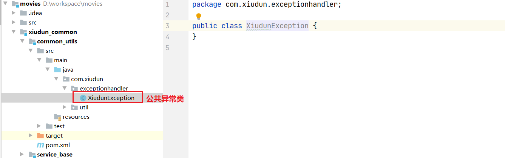
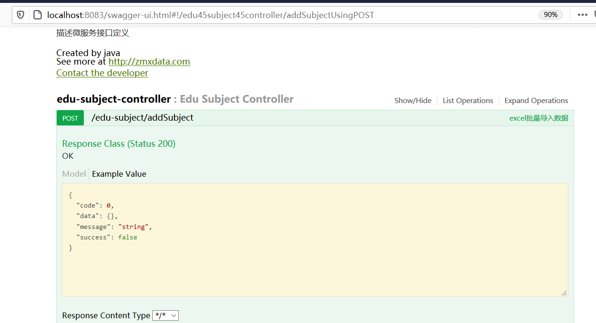

# 在线影视

# 第一章：简介

* 这是一个真实的企业项目
* 技术架构：
  * springCloudAlibaba
  * VUE实现了前后端分离开发(解决跨域的问题)
  * 数据库：mysql
  * ORM:mybatisPlus
* 把我们开发的模块都分为不同的微服务部分
* 把需要上传的图片及视频都存储在**阿里云**中
* 我会把所有的工具、代码、技术文档都放到百度网盘中，我会在回复中添加下载地址


# 第二章：搭建项目环境

## 2.1 创建一个maven项目，作为父工程


## 2.2 pom.xml依赖

```xml
<?xml version="1.0" encoding="UTF-8"?>
<project xmlns="http://maven.apache.org/POM/4.0.0"
         xmlns:xsi="http://www.w3.org/2001/XMLSchema-instance"
         xsi:schemaLocation="http://maven.apache.org/POM/4.0.0 http://maven.apache.org/xsd/maven-4.0.0.xsd">
    <modelVersion>4.0.0</modelVersion>

    <groupId>com.xiudun</groupId>
    <artifactId>movies</artifactId>
    <version>1.0-SNAPSHOT</version>
    <parent>
        <groupId>org.springframework.boot</groupId>
        <artifactId>spring-boot-starter-parent</artifactId>
        <version>2.1.3.RELEASE</version>
    </parent>
    <name>movies</name>
    <packaging>pom</packaging>
    <properties>
        <java.version>1.8</java.version>
        <project.build.sourceEncoding>UTF-8</project.build.sourceEncoding>
        <project.reporting.outputEncoding>UTF-8</project.reporting.outputEncoding>
        <spring-cloud.version>Greenwich.RELEASE</spring-cloud.version>
        <spring-cloud-alibaba.version>2.1.0.RELEASE</spring-cloud-alibaba.version>
        <mybatis-plus.version>3.0.5</mybatis-plus.version>
        <velocity.version>2.0</velocity.version>
        <swagger.version>2.7.0</swagger.version>
        <aliyun.oss.version>2.8.3</aliyun.oss.version>
        <jodatime.version>2.10.1</jodatime.version>
        <poi.version>3.17</poi.version>
        <commons-fileupload.version>1.3.1</commons-fileupload.version>
        <commons-io.version>2.6</commons-io.version>
        <httpclient.version>4.5.1</httpclient.version>
        <jwt.version>0.7.0</jwt.version>
        <aliyun-java-sdk-core.version>4.3.3</aliyun-java-sdk-core.version>
        <aliyun-sdk-oss.version>3.1.0</aliyun-sdk-oss.version>
        <aliyun-java-sdk-vod.version>2.15.2</aliyun-java-sdk-vod.version>
        <aliyun-java-vod-upload.version>1.4.11</aliyun-java-vod-upload.version>
        <aliyun-sdk-vod-upload.version>1.4.11</aliyun-sdk-vod-upload.version>
        <fastjson.version>1.2.28</fastjson.version>
        <gson.version>2.8.2</gson.version>
        <json.version>20170516</json.version>
        <commons-dbutils.version>1.7</commons-dbutils.version>
        <canal.client.version>1.1.0</canal.client.version>
        <docker.image.prefix>zx</docker.image.prefix>
        <cloud-alibaba.version>0.2.2.RELEASE</cloud-alibaba.version>
    </properties>

    <dependencyManagement>
            <dependencies>
                <dependency>
                    <groupId>org.springframework.cloud</groupId>
                    <artifactId>spring-cloud-dependencies</artifactId>
                    <version>${spring-cloud.version}</version>
                    <type>pom</type>
                    <scope>import</scope>
                </dependency>
                <dependency>
                    <groupId>com.alibaba.cloud</groupId>
                    <artifactId>spring-cloud-alibaba-dependencies</artifactId>
                    <version>${spring-cloud-alibaba.version}</version>
                    <type>pom</type>
                    <scope>import</scope>
                </dependency>
            <!--mybatis-plus 持久层-->
            <dependency>
                <groupId>com.baomidou</groupId>
                <artifactId>mybatis-plus-boot-starter</artifactId>
                <version>${mybatis-plus.version}</version>
            </dependency>

            <!-- velocity 模板引擎, Mybatis Plus 代码生成器需要 -->
            <dependency>
                <groupId>org.apache.velocity</groupId>
                <artifactId>velocity-engine-core</artifactId>
                <version>${velocity.version}</version>
            </dependency>

            <!--swagger-->
            <dependency>
                <groupId>io.springfox</groupId>
                <artifactId>springfox-swagger2</artifactId>
                <version>${swagger.version}</version>
            </dependency>
            <!--swagger ui-->
            <dependency>
                <groupId>io.springfox</groupId>
                <artifactId>springfox-swagger-ui</artifactId>
                <version>${swagger.version}</version>
            </dependency>

            <!--aliyunOSS-->
            <dependency>
                <groupId>com.aliyun.oss</groupId>
                <artifactId>aliyun-sdk-oss</artifactId>
                <version>${aliyun.oss.version}</version>
            </dependency>

            <!--日期时间工具-->
            <dependency>
                <groupId>joda-time</groupId>
                <artifactId>joda-time</artifactId>
                <version>${jodatime.version}</version>
            </dependency>

            <!--xls-->
            <dependency>
                <groupId>org.apache.poi</groupId>
                <artifactId>poi</artifactId>
                <version>${poi.version}</version>
            </dependency>
            <!--xlsx-->
            <dependency>
                <groupId>org.apache.poi</groupId>
                <artifactId>poi-ooxml</artifactId>
                <version>${poi.version}</version>
            </dependency>

            <!--文件上传-->
            <dependency>
                <groupId>commons-fileupload</groupId>
                <artifactId>commons-fileupload</artifactId>
                <version>${commons-fileupload.version}</version>
            </dependency>

            <!--commons-io-->
            <dependency>
                <groupId>commons-io</groupId>
                <artifactId>commons-io</artifactId>
                <version>${commons-io.version}</version>
            </dependency>

            <!--httpclient-->
            <dependency>
                <groupId>org.apache.httpcomponents</groupId>
                <artifactId>httpclient</artifactId>
                <version>${httpclient.version}</version>
            </dependency>

            <dependency>
                <groupId>com.google.code.gson</groupId>
                <artifactId>gson</artifactId>
                <version>${gson.version}</version>
            </dependency>

            <!-- JWT -->
            <dependency>
                <groupId>io.jsonwebtoken</groupId>
                <artifactId>jjwt</artifactId>
                <version>${jwt.version}</version>
            </dependency>

            <!--aliyun-->
            <dependency>
                <groupId>com.aliyun</groupId>
                <artifactId>aliyun-java-sdk-core</artifactId>
                <version>${aliyun-java-sdk-core.version}</version>
            </dependency>
            <dependency>
                <groupId>com.aliyun.oss</groupId>
                <artifactId>aliyun-sdk-oss</artifactId>
                <version>${aliyun-sdk-oss.version}</version>
            </dependency>
            <dependency>
                <groupId>com.aliyun</groupId>
                <artifactId>aliyun-java-sdk-vod</artifactId>
                <version>${aliyun-java-sdk-vod.version}</version>
            </dependency>
            <dependency>
                <groupId>com.aliyun</groupId>
                <artifactId>aliyun-java-vod-upload</artifactId>
                <version>${aliyun-java-vod-upload.version}</version>
            </dependency>
            <dependency>
                <groupId>com.aliyun</groupId>
                <artifactId>aliyun-sdk-vod-upload</artifactId>
                <version>${aliyun-sdk-vod-upload.version}</version>
            </dependency>
            <dependency>
                <groupId>com.alibaba</groupId>
                <artifactId>fastjson</artifactId>
                <version>${fastjson.version}</version>
            </dependency>
            <dependency>
                <groupId>org.json</groupId>
                <artifactId>json</artifactId>
                <version>${json.version}</version>
            </dependency>

            <dependency>
                <groupId>commons-dbutils</groupId>
                <artifactId>commons-dbutils</artifactId>
                <version>${commons-dbutils.version}</version>
            </dependency>

            <dependency>
                <groupId>com.alibaba.otter</groupId>
                <artifactId>canal.client</artifactId>
                <version>${canal.client.version}</version>
            </dependency>
        </dependencies>
    </dependencyManagement>

    <build>
        <plugins>
            <plugin>
                <groupId>org.springframework.boot</groupId>
                <artifactId>spring-boot-maven-plugin</artifactId>
            </plugin>
        </plugins>
    </build>
</project>
```


## 2.3 创建子工程

### 2.3.1 xiudun_service服务的子工程

### 2.3.2 xiudun_common公共工程


* pom.xml

```xml
<?xml version="1.0" encoding="UTF-8"?>
<project xmlns="http://maven.apache.org/POM/4.0.0"
         xmlns:xsi="http://www.w3.org/2001/XMLSchema-instance"
         xsi:schemaLocation="http://maven.apache.org/POM/4.0.0 http://maven.apache.org/xsd/maven-4.0.0.xsd">
    <parent>
        <artifactId>movies</artifactId>
        <groupId>com.xiudun</groupId>
        <version>1.0-SNAPSHOT</version>
    </parent>
    <modelVersion>4.0.0</modelVersion>
    <artifactId>xiudun_common</artifactId>
    <packaging>pom</packaging>

    <dependencies>
        <dependency>
            <groupId>org.springframework.boot</groupId>
            <artifactId>spring-boot-starter-web</artifactId>
            <scope>provided</scope>
        </dependency>
        <!--mybatis-plus-->
        <dependency>
            <groupId>com.baomidou</groupId>
            <artifactId>mybatis-plus-boot-starter</artifactId>
            <scope>provided</scope>
        </dependency>
        <!--为了简化实体类，配置lombok-->
        <dependency>
            <groupId>org.projectlombok</groupId>
            <artifactId>lombok</artifactId>
        </dependency>

        <!--为了测试前后端分离项目 swagger-->
        <dependency>
            <groupId>io.springfox</groupId>
            <artifactId>springfox-swagger2</artifactId>
        </dependency>
        <dependency>
            <groupId>io.springfox</groupId>
            <artifactId>springfox-swagger-ui</artifactId>
        </dependency>

        <!--二级缓存配置-->
        <dependency>
            <groupId>org.springframework.boot</groupId>
            <artifactId>spring-boot-starter-data-redis</artifactId>
        </dependency>
    </dependencies>

</project>
```


* pom.xml

```xml
<?xml version="1.0" encoding="UTF-8"?>
<project xmlns="http://maven.apache.org/POM/4.0.0"
         xmlns:xsi="http://www.w3.org/2001/XMLSchema-instance"
         xsi:schemaLocation="http://maven.apache.org/POM/4.0.0 http://maven.apache.org/xsd/maven-4.0.0.xsd">
    <parent>
        <artifactId>movies</artifactId>
        <groupId>com.xiudun</groupId>
        <version>1.0-SNAPSHOT</version>
    </parent>
    <modelVersion>4.0.0</modelVersion>
    <artifactId>xiudun_service</artifactId>
    <packaging>pom</packaging>

    <dependencies>
        <!--nacos客户端-->
        <dependency>
            <groupId>com.alibaba.cloud</groupId>
            <artifactId>spring-cloud-starter-alibaba-nacos-discovery</artifactId>
        </dependency>
        <!--web-->
        <dependency>
            <groupId>org.springframework.boot</groupId>
            <artifactId>spring-boot-starter-web</artifactId>
        </dependency>

        <!--mybatis-plus-->
        <dependency>
            <groupId>com.baomidou</groupId>
            <artifactId>mybatis-plus-boot-starter</artifactId>
        </dependency>
        <!--mysql驱动-->
        <dependency>
            <groupId>mysql</groupId>
            <artifactId>mysql-connector-java</artifactId>
        </dependency>

        <!--mybatisplus-代码生成器的模板-->
        <dependency>
            <groupId>org.apache.velocity</groupId>
            <artifactId>velocity-engine-core</artifactId>
        </dependency>

        <!--swagger-->
        <dependency>
            <groupId>io.springfox</groupId>
            <artifactId>springfox-swagger2</artifactId>
        </dependency>
        <dependency>
            <groupId>io.springfox</groupId>
            <artifactId>springfox-swagger-ui</artifactId>
        </dependency>

        <!--lombok-->
        <dependency>
            <groupId>org.projectlombok</groupId>
            <artifactId>lombok</artifactId>
        </dependency>

        <!--xls-->
        <dependency>
            <groupId>org.apache.poi</groupId>
            <artifactId>poi</artifactId>
        </dependency>
        <dependency>
            <groupId>org.apache.poi</groupId>
            <artifactId>poi-ooxml</artifactId>
        </dependency>
        <dependency>
            <groupId>commons-fileupload</groupId>
            <artifactId>commons-fileupload</artifactId>
        </dependency>

        <!--httpCilents-->
        <dependency>
            <groupId>org.apache.httpcomponents</groupId>
            <artifactId>httpclient</artifactId>
        </dependency>
        <dependency>
            <groupId>commons-io</groupId>
            <artifactId>commons-io</artifactId>
        </dependency>

        <!--gson-->
        <dependency>
            <groupId>com.google.code.gson</groupId>
            <artifactId>gson</artifactId>
        </dependency>
    </dependencies>

</project>
```


### 2.3.3 在xiudun_common下创建子模块common_util和service_base

#### 2.3.3.1 创建service_base模块


* pom.xml

```xml
<?xml version="1.0" encoding="UTF-8"?>
<project xmlns="http://maven.apache.org/POM/4.0.0"
         xmlns:xsi="http://www.w3.org/2001/XMLSchema-instance"
         xsi:schemaLocation="http://maven.apache.org/POM/4.0.0 http://maven.apache.org/xsd/maven-4.0.0.xsd">
    <parent>
        <artifactId>xiudun_common</artifactId>
        <groupId>com.xiudun</groupId>
        <version>1.0-SNAPSHOT</version>
    </parent>
    <modelVersion>4.0.0</modelVersion>

    <artifactId>service_base</artifactId>

    <dependencies>
        <!--添加工具模块-->
        <dependency>
            <groupId>com.xiudun</groupId>
            <artifactId>common_util</artifactId>
            <version>1.0-SNAPSHOT</version>
        </dependency>
    </dependencies>

</project>
```


#### 2.3.3.2 创建common_util模块


### 2.3.4 在service_base中编写配置swagger类

```java
package com.xiudun.util;

import com.google.common.base.Predicates;
import org.springframework.context.annotation.Bean;
import org.springframework.context.annotation.Configuration;
import springfox.documentation.builders.ApiInfoBuilder;
import springfox.documentation.builders.PathSelectors;
import springfox.documentation.service.ApiInfo;
import springfox.documentation.service.Contact;
import springfox.documentation.spi.DocumentationType;
import springfox.documentation.spring.web.plugins.Docket;
import springfox.documentation.swagger2.annotations.EnableSwagger2;

//配置类
@Configuration
@EnableSwagger2
public class SwaggerConfig {
    //设置接口信息
    private ApiInfo webApiInfo(){
        return new ApiInfoBuilder()
                .title("API文档")
                .description("描述微服务接口定义")
                .version("1.0")
                .contact(new Contact("java", "http://zmxdata.com", "hksupports@163.com"))
                .build();
    }

    //构建接口文档
    @Bean
    public Docket webApiConfig(){
        return new Docket(DocumentationType.SWAGGER_2)
                .groupName("webApi")
                .apiInfo(webApiInfo())
                .select()
                .paths(Predicates.not(PathSelectors.regex("/error.*")))
                .build();
    }
}
```


## 2.4 在xiudun_service模块中创建子模块service_actor

* 演员模块


* pom.xml

```xml
<?xml version="1.0" encoding="UTF-8"?>
<project xmlns="http://maven.apache.org/POM/4.0.0"
         xmlns:xsi="http://www.w3.org/2001/XMLSchema-instance"
         xsi:schemaLocation="http://maven.apache.org/POM/4.0.0 http://maven.apache.org/xsd/maven-4.0.0.xsd">
    <parent>
        <artifactId>xiudun_service</artifactId>
        <groupId>com.xiudun</groupId>
        <version>1.0-SNAPSHOT</version>
    </parent>
    <modelVersion>4.0.0</modelVersion>

    <artifactId>service_actor</artifactId>
    <dependencies>
        <dependency>
            <groupId>com.alibaba</groupId>
            <artifactId>easyexcel</artifactId>
            <version>2.1.1</version>
        </dependency>
    </dependencies>
</project>
```


### 2.4.1 配置公共部分

* 主配置类

```java
package com.xiudun;

import org.mybatis.spring.annotation.MapperScan;
import org.springframework.boot.SpringApplication;
import org.springframework.boot.autoconfigure.SpringBootApplication;
import org.springframework.cloud.client.discovery.EnableDiscoveryClient;
import springfox.documentation.swagger2.annotations.EnableSwagger2;

@SpringBootApplication
@EnableSwagger2
@EnableDiscoveryClient
@MapperScan("com.xiudun.mapper")
public class ActorApplication {
    public static void main(String[] args) {
        SpringApplication.run(ActorApplication.class,args);
    }
}
```


* 配置文件：application.yml,**注意**：冒号后必须有空格，这是编写格式

```yaml
server:
  port: 8081
spring:
  application:
    name: service_actor
  profiles:
    active: dev
  datasource:
    driver-class-name: com.mysql.cj.jdbc.Driver
    url: jdbc:mysql://localhost:3306/movies?useUnicode=true&characterEncoding=utf8&serverTimezone=GMT%2B8ame
    username: root
    password: root
    #json的时间格式
  jackson:
    date-format: yyyy-MM-dd HH:mm:ss
    time-zone: GMT+8
  #注册中心
  cloud:
    nacos:
      discovery:
        server-addr: localhost:8848 

```

* 先创建数据库
* 再启动nacos


* swagger的测试页面


# 第三章：编写演员模块

## 3.1 生成数据库


## 3.2 代码生成器

```java
package com.xiudun.util;

import com.baomidou.mybatisplus.annotation.DbType;
import com.baomidou.mybatisplus.annotation.IdType;
import com.baomidou.mybatisplus.generator.AutoGenerator;
import com.baomidou.mybatisplus.generator.config.DataSourceConfig;
import com.baomidou.mybatisplus.generator.config.GlobalConfig;
import com.baomidou.mybatisplus.generator.config.PackageConfig;
import com.baomidou.mybatisplus.generator.config.StrategyConfig;
import com.baomidou.mybatisplus.generator.config.rules.DateType;
import com.baomidou.mybatisplus.generator.config.rules.NamingStrategy;
import org.junit.Test;

/**
 * @author
 */
public class CodeGenerator {

    @Test
    public void run() {

        // 1、创建代码生成器
        AutoGenerator mpg = new AutoGenerator();

        // 2、全局配置
        GlobalConfig gc = new GlobalConfig();
        String projectPath = System.getProperty("user.dir");
        gc.setOutputDir(projectPath + "/src/main/java");
        gc.setAuthor("xiudun");
        gc.setOpen(false); //生成后是否打开资源管理器
        gc.setFileOverride(false); //重新生成时文件是否覆盖
        gc.setServiceName("%sService");	//去掉Service接口的首字母I
        gc.setIdType(IdType.ID_WORKER_STR); //主键策略
        gc.setDateType(DateType.ONLY_DATE);//定义生成的实体类中日期类型
        gc.setSwagger2(true);//开启Swagger2模式

        mpg.setGlobalConfig(gc);

        // 3、数据源配置
        DataSourceConfig dsc = new DataSourceConfig();
        dsc.setUrl("jdbc:mysql://localhost:3306/xiudun?useUnicode=true&characterEncoding=utf8&serverTimezone=GMT%2B8");
        dsc.setDriverName("com.mysql.cj.jdbc.Driver");
        dsc.setUsername("root");
        dsc.setPassword("root");
        dsc.setDbType(DbType.MYSQL);
        mpg.setDataSource(dsc);

        // 4、包配置
        PackageConfig pc = new PackageConfig();
        pc.setModuleName("edu"); //模块名
        pc.setParent("com.xiudun");
        pc.setController("controller");
        pc.setEntity("entity");
        pc.setService("service");
        pc.setMapper("mapper");
        mpg.setPackageInfo(pc);

        // 5、策略配置
        StrategyConfig strategy = new StrategyConfig();
        strategy.setInclude("xiudun_common");
        strategy.setNaming(NamingStrategy.underline_to_camel);//数据库表映射到实体的命名策略
        strategy.setTablePrefix(pc.getModuleName() + "_"); //生成实体时去掉表前缀

        strategy.setColumnNaming(NamingStrategy.underline_to_camel);//数据库表字段映射到实体的命名策略
        strategy.setEntityLombokModel(true); // lombok 模型 @Accessors(chain = true) setter链式操作

        strategy.setRestControllerStyle(true); //restful api风格控制器
        strategy.setControllerMappingHyphenStyle(true); //url中驼峰转连字符

        mpg.setStrategy(strategy);


        // 6、执行
        mpg.execute();
    }
}
```


## 3.3  编写演员的功能实现

### 3.3.1 dao数据访问层

```java
package com.xiudun.mapper;

import com.xiudun.entity.EduActor;
import com.baomidou.mybatisplus.core.mapper.BaseMapper;

/**
 * <p>
 * 演员 Mapper 接口
 * </p>
 *
 * @author xiudun
 * @since 2021-02-21
 */
public interface EduActorMapper extends BaseMapper<EduActor> {
}

```

### 3.3.2 service业务层

* 接口

```java
package com.xiudun.service;

import com.xiudun.entity.EduActor;
import com.baomidou.mybatisplus.extension.service.IService;

/**
 * <p>
 * 演员 服务类
 * </p>
 *
 * @author xiudun
 * @since 2021-02-21
 */
public interface EduActorService extends IService<EduActor> {
}
```


* 实现类

```java
package com.xiudun.service.impl;

import com.xiudun.entity.EduActor;
import com.xiudun.mapper.EduActorMapper;
import com.xiudun.service.EduActorService;
import com.baomidou.mybatisplus.extension.service.impl.ServiceImpl;
import org.springframework.stereotype.Service;

/**
 * <p>
 * 演员 服务实现类
 * </p>
 *
 * @author xiudun
 * @since 2021-02-21
 */
@Service
public class EduActorServiceImpl extends ServiceImpl<EduActorMapper, EduActor> implements EduActorService {}
```


### 3.3.3 controller控制层

```java
package com.xiudun.controller;

import com.xiudun.service.EduActorService;
import io.swagger.annotations.ApiOperation;
import org.springframework.beans.factory.annotation.Autowired;
import org.springframework.web.bind.annotation.GetMapping;
import org.springframework.web.bind.annotation.RequestMapping;
import org.springframework.web.bind.annotation.RestController;
import java.util.List;

/**
 * <p>
 * 演员 前端控制器
 * </p>
 *
 * @author xiudun
 * @since 2021-02-21
 */
@RestController
@RequestMapping("/edu-actor")
public class EduActorController {

    //依赖注册service
    @Autowired
    private EduActorService actorService;
    
    @ApiOperation("显示演员信息")
    @GetMapping("/list")
    public List list(){
        return actorService.list(null);
    }
}
```


## 3.4 编写逻辑删除(假删除)拦截器、编写分页的拦截器

* service_base模块中编写


```java
package com.xiudun.util;

import com.baomidou.mybatisplus.core.injector.ISqlInjector;
import com.baomidou.mybatisplus.extension.injector.LogicSqlInjector;
import com.baomidou.mybatisplus.extension.plugins.PaginationInterceptor;
import org.springframework.context.annotation.Bean;
import org.springframework.context.annotation.Configuration;
import org.springframework.transaction.annotation.EnableTransactionManagement;

//配置
@Configuration
@EnableTransactionManagement
public class MoviesConfig {
    
    //逻辑删除插件
    @Bean
    public ISqlInjector sqlInjector(){
        return new LogicSqlInjector();
    }
    
    //分页插件
    @Bean
    public PaginationInterceptor paginationInterceptor(){
        return new PaginationInterceptor();
    }    
}
```


## 3.5 在service_base模块中完成自动填充

* 就是自动完成数据添加的时间和修改的时间及逻辑删除的默认值填写


* 编写实现

```java
package com.xiudun.util;

import com.baomidou.mybatisplus.core.handlers.MetaObjectHandler;
import org.apache.ibatis.reflection.MetaObject;
import org.springframework.stereotype.Component;
import java.util.Date;

@Component
public class MyMetaObjectHandler implements MetaObjectHandler {
    @Override
    public void insertFill(MetaObject metaObject) {//添加数据
        //添加日期到指定的字段中
        setFieldValByName("gmtCreate",new Date(),metaObject);
        setFieldValByName("gmtModified",new Date(),metaObject);
        //逻辑删除的默认值
        setFieldValByName("isDeleted",0,metaObject);
    }

    @Override
    public void updateFill(MetaObject metaObject) {//修改数据
        setFieldValByName("gmtModified",new Date(),metaObject);
    }
}
```


* 添加一个日志输出，方便代码的调试

```properties
#配置日志
mybatis-plus.configuration.log-impl=org.apache.ibatis.logging.stdout.StdOutImpl
```

* 在对应的实体Bean中添加


### 

```java
package com.xiudun.controller;

import com.xiudun.entity.EduActor;
import com.xiudun.service.EduActorService;
import io.swagger.annotations.ApiOperation;
import io.swagger.annotations.ApiParam;
import org.springframework.beans.factory.annotation.Autowired;
import org.springframework.web.bind.annotation.*;
import java.util.List;

/**
 * <p>
 * 演员 前端控制器
 * </p>
 *
 * @author xiudun
 * @since 2021-02-21
 */
@RestController
@RequestMapping("/edu-actor")
public class EduActorController {

    //依赖注册service
    @Autowired
    private EduActorService actorService;

    @ApiOperation("显示演员信息")
    @GetMapping("/list")
    public List list(){
        return actorService.list(null);
    }

    @ApiOperation("保存演员数据")
    @PostMapping("/save")
    public void saveActor(EduActor actor){
        actorService.save(actor);
    }

    @ApiOperation("逻辑删除演员")
    @DeleteMapping("del/{id}")
    public void delete(@ApiParam(name = "id",value = "演员的主键",required = true)
                       @PathVariable String id){
        actorService.removeById(id);
    }
}
```


# 第四章：配置公共设置

## 4.1 公共的返回数据格式

* 在我们的项目中要求都是封装成json返回，一般我们会将所有接口的数据格式统一。
* 列表格式：

```properties
{
   "success":true,
   "code":20000,
   "message":"成功",
   "data":{
      "items":[
         {
            "id":"1001",
            "name":"刘德华",
            "intro":"香港的著名演员"
         }
      ]
   }
}
```


* 分页格式：

```properties
{
   "success":true,
   "code":20000,
   "message":"成功",
   "data":{
      "total":20,
      "rows":[
         {
            "id":"1001",
            "name":"刘德华",
            "intro":"香港的著名演员"
         }
      ]
   }
}
```


* 无返回数据格式

```properties
{
   "success":true,
   "code":20000,
   "message":"成功",
   "data":{}
}
```

* 失败数据格式

```properties
{
   "success":false,
   "code":20001,
   "message":"失败",
   "data":{}
}
```


* 统一格式：

```properties
{
   "success":布尔,//响应是否成功
   "code":数字,//响应码
   "message":字符串,//返回信息
   "data":HashMap//返回数据
}
```


## 4.2 在子模块xiudun_common/common_util中创建


* 创建返回码的接口

```java
package com.xiudun.util;

//返回码接口
public interface ResultCode {
    int SUCCESS = 20000;//成功
    int ERROR = 20001;//失败
}
```


* 创建结果类

```java
package com.xiudun.util;

import io.swagger.annotations.ApiModelProperty;
import lombok.Data;
import java.util.HashMap;
import java.util.Map;

@Data
public class R {

    @ApiModelProperty("是否成功")
    private Boolean success;

    @ApiModelProperty("返回码")
    private Integer code;

    @ApiModelProperty("返回消息")
    private String message;

    @ApiModelProperty("返回数据")
    private Map<String,Object> data = new HashMap<>();

    //构造方法
    public R() { }

    //静态方法
    public static R ok(){
        R r = new R();
        r.setSuccess(true);
        r.setCode(ResultCode.SUCCESS);
        r.setMessage("成功");
        return r;
    }

    public static R error(){
        R r = new R();
        r.setSuccess(false);
        r.setCode(ResultCode.ERROR);
        r.setMessage("失败");
        return r;
    }

    public R success(boolean success){
        this.setSuccess(success);
        return this;
    }

    public R message(String message){
        this.setMessage(message);
        return this;
    }

    public R code(int code){
        this.setCode(code);
        return this;
    }

    public R data(String key,String value){
        this.data.put(key,value);
        return this;
    }

    public R data(Map<String,Object> map){
        this.setData(map);
        return this;
    }
}
```


### 4.2.1 在使用的模块中引入即可


```xml
 <dependency>
   <groupId>com.xiudun</groupId>
   <artifactId>common_util</artifactId>
   <version>1.0-SNAPSHOT</version>
</dependency>
```

* 修改演员的controller

```java
package com.xiudun.controller;

import com.xiudun.entity.EduActor;
import com.xiudun.service.EduActorService;
import com.xiudun.util.R;
import io.swagger.annotations.ApiOperation;
import io.swagger.annotations.ApiParam;
import org.springframework.beans.factory.annotation.Autowired;
import org.springframework.web.bind.annotation.*;

/**
 * <p>
 * 演员 前端控制器
 * </p>
 *
 * @author xiudun
 * @since 2021-02-21
 */
@RestController
@RequestMapping("/edu-actor")
public class EduActorController {

    //依赖注册service
    @Autowired
    private EduActorService actorService;

    @ApiOperation("显示演员信息")
    @GetMapping("/list")
    public R list(){
        return R.ok().data("items",actorService.list(null));
    }

    @ApiOperation("保存演员数据")
    @PostMapping("/save")
    public R saveActor(EduActor actor){
        actorService.save(actor);
        return R.ok();
    }

    @ApiOperation("逻辑删除演员")
    @DeleteMapping("del/{id}")
    public R delete(@ApiParam(name = "id",value = "演员的主键",required = true)
                       @PathVariable String id){
        actorService.removeById(id);
        return R.ok();
    }
}
```


### 4.2.2 数据的分页

* service

```java
package com.xiudun.service;

import com.baomidou.mybatisplus.extension.plugins.pagination.Page;
import com.xiudun.entity.EduActor;
import com.baomidou.mybatisplus.extension.service.IService;

import java.util.Map;

/**
 * <p>
 * 演员 服务类
 * </p>
 *
 * @author xiudun
 * @since 2021-02-21
 */
public interface EduActorService extends IService<EduActor> {

    //分页
    Map<String,Object> getActorList(Page<EduActor> page);

}
```


* serviceImpl

```java
package com.xiudun.service.impl;

import com.baomidou.mybatisplus.core.conditions.query.QueryWrapper;
import com.baomidou.mybatisplus.extension.plugins.pagination.Page;
import com.xiudun.entity.EduActor;
import com.xiudun.mapper.EduActorMapper;
import com.xiudun.service.EduActorService;
import com.baomidou.mybatisplus.extension.service.impl.ServiceImpl;
import org.springframework.stereotype.Service;

import java.util.HashMap;
import java.util.List;
import java.util.Map;

/**
 * <p>
 * 演员 服务实现类
 * </p>
 *
 * @author xiudun
 * @since 2021-02-21
 */
@Service
public class EduActorServiceImpl extends ServiceImpl<EduActorMapper, EduActor> implements EduActorService {
    @Override
    public Map<String, Object> getActorList(Page<EduActor> page) {
        //分页条件
        QueryWrapper<EduActor> wrapper = new QueryWrapper<>();
        wrapper.orderByDesc("id");
        baseMapper.selectPage(page,wrapper);
        //当前页、总的页数、每页记录数、总的记录数
        long current = page.getCurrent();
        long pages = page.getPages();
        long size = page.getSize();
        long total = page.getTotal();
        //记录
        List<EduActor> records = page.getRecords();
        //上一页、下一页
        boolean hasPrevious = page.hasPrevious();
        boolean hasNext = page.hasNext();
        //添加一下分页条件
        Map<String, Object> map = new HashMap<>();
        map.put("records",records);
        map.put("current",current);
        map.put("pages",pages);
        map.put("size",size);
        map.put("total",total);
        map.put("hasPrevious",hasPrevious);
        map.put("hasNext",hasNext);

        return map;
    }
}
```


* controller

```java
package com.xiudun.controller;

import com.baomidou.mybatisplus.extension.plugins.pagination.Page;
import com.xiudun.entity.EduActor;
import com.xiudun.service.EduActorService;
import com.xiudun.util.R;
import io.swagger.annotations.ApiOperation;
import io.swagger.annotations.ApiParam;
import org.springframework.beans.factory.annotation.Autowired;
import org.springframework.web.bind.annotation.*;

import java.util.List;

/**
 * <p>
 * 演员 前端控制器
 * </p>
 *
 * @author xiudun
 * @since 2021-02-21
 */
@RestController
@RequestMapping("/edu-actor")
public class EduActorController {

    //依赖注册service
    @Autowired
    private EduActorService actorService;

    @ApiOperation("显示演员信息")
    @GetMapping("/list")
    public R list(){
        return R.ok().data("items",actorService.list(null));
    }

    @ApiOperation("保存演员数据")
    @PostMapping("/save")
    public R saveActor(EduActor actor){
        actorService.save(actor);
        return R.ok();
    }

    @ApiOperation("逻辑删除演员")
    @DeleteMapping("del/{id}")
    public R delete(@ApiParam(name = "id",value = "演员的主键",required = true)
                       @PathVariable String id){
        actorService.removeById(id);
        return R.ok();
    }
    
    @ApiOperation("演员分页")
    @GetMapping("{page}/{limit}")
    public R listPage(@ApiParam(name = "page",value = "当前页码",required = true)
                      @PathVariable long page,
                      @ApiParam(name = "limie",value = "每页显示的记录数",required = true)
                      @PathVariable long limit){
        Page<EduActor> actorPage = new Page<>();
        actorService.getActorList(actorPage);
        List<EduActor> records = actorPage.getRecords();
        long total = actorPage.getTotal();
        //返回
        return R.ok().data("total", total).data("rows", records);
    }
}
```


### 4.2.3 演员完成条件查询

* 根据演员的名称、头衔level、演员的演戏时间

#### 4.2.3.1 创建一个查询类

```java
package com.xiudun.query;

import io.swagger.annotations.ApiModel;
import io.swagger.annotations.ApiModelProperty;
import lombok.Data;

//演员的查询条件类
@ApiModel(value = "actor查询对象",description = "把演员的查询条件封装")
@Data
public class ActorQuery {
    @ApiModelProperty(value = "演员的名称，模糊查询")
    private String name;

    @ApiModelProperty(value = "头衔，1表示一线")
    private Integer level;

    @ApiModelProperty(value = "开始查询时间",example = "2020-02-25 14:19:02")
    private String begin;

    @ApiModelProperty(value = "结束查询时间",example = "2020-12-25 14:19:02")
    private String end;
}
```


#### 4.2.3.2 业务编写

* service

```java
package com.xiudun.service;

import com.baomidou.mybatisplus.extension.plugins.pagination.Page;
import com.xiudun.entity.EduActor;
import com.baomidou.mybatisplus.extension.service.IService;
import com.xiudun.query.ActorQuery;

import java.util.Map;

/**
 * <p>
 * 演员 服务类
 * </p>
 *
 * @author xiudun
 * @since 2021-02-21
 */
public interface EduActorService extends IService<EduActor> {

    //分页
    Map<String,Object> getActorList(Page<EduActor> page);

    //重载
    void getActorList(Page<EduActor> page, ActorQuery actorQuery);
}
```


* serviceImpl

```java
package com.xiudun.service.impl;

import com.baomidou.mybatisplus.core.conditions.query.QueryWrapper;
import com.baomidou.mybatisplus.extension.plugins.pagination.Page;
import com.xiudun.entity.EduActor;
import com.xiudun.mapper.EduActorMapper;
import com.xiudun.query.ActorQuery;
import com.xiudun.service.EduActorService;
import com.baomidou.mybatisplus.extension.service.impl.ServiceImpl;
import org.apache.commons.lang.StringUtils;
import org.springframework.stereotype.Service;

import java.util.HashMap;
import java.util.List;
import java.util.Map;

/**
 * <p>
 * 演员 服务实现类
 * </p>
 *
 * @author xiudun
 * @since 2021-02-21
 */
@Service
public class EduActorServiceImpl extends ServiceImpl<EduActorMapper, EduActor> implements EduActorService {
    @Override
    public Map<String, Object> getActorList(Page<EduActor> page) {
        //分页条件
        QueryWrapper<EduActor> wrapper = new QueryWrapper<>();
        wrapper.orderByDesc("id");
        baseMapper.selectPage(page,wrapper);
        //当前页、总的页数、每页记录数、总的记录数
        long current = page.getCurrent();
        long pages = page.getPages();
        long size = page.getSize();
        long total = page.getTotal();
        //记录
        List<EduActor> records = page.getRecords();
        //上一页、下一页
        boolean hasPrevious = page.hasPrevious();
        boolean hasNext = page.hasNext();
        //添加一下分页条件
        Map<String, Object> map = new HashMap<>();
        map.put("records",records);
        map.put("current",current);
        map.put("pages",pages);
        map.put("size",size);
        map.put("total",total);
        map.put("hasPrevious",hasPrevious);
        map.put("hasNext",hasNext);

        return map;
    }

    @Override
    public void getActorList(Page<EduActor> page, ActorQuery actorQuery) {
        //查询对象
        QueryWrapper<EduActor> queryWrapper = new QueryWrapper<>();
        queryWrapper.orderByDesc("sort");
        //添加查询的条件
        if (actorQuery==null) {
            baseMapper.selectPage(page,queryWrapper);
            return ;
        }

        //演员的名称
        String name = actorQuery.getName();

        //演员的等级
        Integer level = actorQuery.getLevel();
        //演员时间段
        String begin = actorQuery.getBegin();
        String end = actorQuery.getEnd();

        //判断
        if (!name.isEmpty()) {
            //模糊
            queryWrapper.like("name",name);
        }
        if (!StringUtils.isEmpty(level+"")) {
            queryWrapper.eq("level",level);
        }
        if (!begin.isEmpty()) {
            queryWrapper.ge("gmt_create",begin);
        }
        if (!end.isEmpty()) {
            queryWrapper.le("gmt_create",end);
        }

        //添加条件到mapper
        baseMapper.selectPage(page,queryWrapper);
    }
}
```

* controller

```java
package com.xiudun.controller;

import com.baomidou.mybatisplus.extension.plugins.pagination.Page;
import com.xiudun.entity.EduActor;
import com.xiudun.query.ActorQuery;
import com.xiudun.service.EduActorService;
import com.xiudun.util.R;
import io.swagger.annotations.ApiOperation;
import io.swagger.annotations.ApiParam;
import org.springframework.beans.factory.annotation.Autowired;
import org.springframework.web.bind.annotation.*;

import java.util.List;

/**
 * <p>
 * 演员 前端控制器
 * </p>
 *
 * @author xiudun
 * @since 2021-02-21
 */
@RestController
@RequestMapping("/edu-actor")
public class EduActorController {

    //依赖注册service
    @Autowired
    private EduActorService actorService;

    @ApiOperation("显示演员信息")
    @GetMapping("/list")
    public R list(){
        return R.ok().data("items",actorService.list(null));
    }

    @ApiOperation("保存演员数据")
    @PostMapping("/save")
    public R saveActor(EduActor actor){
        actorService.save(actor);
        return R.ok();
    }

    @ApiOperation("逻辑删除演员")
    @DeleteMapping("del/{id}")
    public R delete(@ApiParam(name = "id",value = "演员的主键",required = true)
                       @PathVariable String id){
        actorService.removeById(id);
        return R.ok();
    }

    @ApiOperation("演员分页")
    @GetMapping("{page}/{limit}")
    public R listPage(@ApiParam(name = "page",value = "当前页码",required = true)
                      @PathVariable long page,
                      @ApiParam(name = "limit",value = "每页显示的记录数",required = true)
                      @PathVariable long limit,
                      @ApiParam(name = "actorQuery",value = "查询对象",required = false)
                      ActorQuery actorQuery){
        //添加分页参数
        Page<EduActor> actorPage = new Page<>(page,limit);
//        actorService.getActorList(actorPage);
        //添加查询条件
        actorService.pageQuery(actorPage,actorQuery);

        List<EduActor> records = actorPage.getRecords();
        long total = actorPage.getTotal();
        //返回
        return R.ok().data("total", total).data("rows", records);
    }
}
```


## 4.3 编写统一异常处理



* 自定义异常类

```java
package com.xiudun.exceptionhandler;

import lombok.AllArgsConstructor;
import lombok.Data;
import lombok.NoArgsConstructor;

@Data
@AllArgsConstructor
@NoArgsConstructor
public class XiudunException extends RuntimeException{
    private Integer code;//异常码
    private String msg;//异常信息
}
```

* 全局统一异常信息类

```java
package com.xiudun.exceptionhandler;

import com.xiudun.util.R;
import io.swagger.annotations.ApiOperation;
import org.springframework.web.bind.annotation.ControllerAdvice;
import org.springframework.web.bind.annotation.ExceptionHandler;
import org.springframework.web.bind.annotation.ResponseBody;

@ControllerAdvice
public class GlobalExceptionHandler {

    @ApiOperation("指定出现异常调用的方法")
    @ExceptionHandler(Exception.class)
    @ResponseBody//返回的数据格式(json)
    public R error(Exception e){
        e.printStackTrace();
        return R.error().message("这是一个全局的异常...");
    }

    @ApiOperation("自定义异常")
    @ExceptionHandler(XiudunException.class)
    @ResponseBody//返回的数据格式(json)
    public R error(XiudunException e){
        e.printStackTrace();
        return R.error().code(e.getCode()).message(e.getMessage());
    }

    @ApiOperation("特定异常")
    @ExceptionHandler(ArithmeticException.class)
    @ResponseBody//返回的数据格式(json)
    public R error(ArithmeticException e){
        e.printStackTrace();
        return R.error().message("执行了ArithmeticException异常...");
    }
}
```


# 第五章：演员前端开发

* #### 使用vue的脚手架(vue-admin-template-master)+elementUI完成前端展现

* #### ide: Visual Studio Code

## 5.1 解压vue-admin-template-master模板到指定的目录中


* 需要在线安装依赖的软件

```properties
npm install
```


* 下载后的依赖都在node_modules目录中


* 启动模块

```properties
npm run dev
```


* 浏览器地址：http://localhost:9528


* 去掉代码检查


## 5.2 模板的目录结构


* src


* 国际化配置


## 5.3 调试登录的错误


* 查看登录代码


* 把连接的地址修改为自己项目的连接


* 编写登录方法


```java
package com.xiudun.controller;
// 自己编写一个登录

import com.xiudun.util.R;
import org.springframework.web.bind.annotation.GetMapping;
import org.springframework.web.bind.annotation.PostMapping;
import org.springframework.web.bind.annotation.RequestMapping;
import org.springframework.web.bind.annotation.RestController;

@RestController
@RequestMapping("user")
@CrossOrigin//跨域
public class ActorLoginController {

    //登录
    @PostMapping("login")
    public R login(){
        return R.ok().data("token", "admin");
    }

    //登录返回信息
    @GetMapping("info")
    public R info(){
        return R.ok().data("roles", "[admin]")
                .data("name", "admin")
                .data("avatar", "xxx");
    }
}
```


## 5.4 编写演员前端


### 5.4.1 编写路由

* src/router/index.js添加演员路由

```js
  {
    path: '/演员信息',
    component: Layout,
    redirect: '/example/table',
    name: 'Example',
    meta: { title: '演员信息', icon: 'example' },
    children: [
      {
        path: 'table',
        name: 'Table',
        component: () => import('@/views/actor/list'),
        meta: { title: '演员列表', icon: 'table' }
      },
      {
        path: 'tree',
        name: 'Tree',
        component: () => import('@/views/tree/index'),
        meta: { title: '添加演员', icon: 'tree' }
      }
    ]
  }
```


* 编写可以访问后台代码的js脚本，src/api/movies/actor.js

```js
import request from '@/utils/request'

export function getPageList(page, limit,searchObj) {
    return request({
      url: `/edu-actor/${page}/${limit}`,
      method: 'get',
      data: searchObj
    })
  }
```


### 5.4.2 编写vue页面

* 编写list.vue页面显示演员信息
* 编写saveActor.vue页面保存演员信息


#### 5.4.2.1 编写演员的列表页面list.vue

```vue
<template>
  <div class="app-container">
    <!-- 演员查询表单 -->
    <el-form :inline="true" class="demo-form-inline">
      <el-form-item label="演员名称">
        <el-input v-model="actorQuery.name" placeholder="演员名称"></el-input>
      </el-form-item>
      <el-form-item label="演员头衔">
        <el-select v-model="actorQuery.level" placeholder="演员头衔">
          <el-option label="一线演员" value="1"></el-option>
          <el-option label="二线演员" value="2"></el-option>
        </el-select>
      </el-form-item>
      <el-form-item label="添加时间">
        <el-date-picker
          v-model="actorQuery.begin"
          type="datetime"
          placeholder="选择开始日期时间"
          value-format="yyyy-MM-dd HH:mm:ss"
          default-time="00:00:00"
        />
      </el-form-item>
      <el-form-item label="添加时间">
        <el-date-picker
          v-model="actorQuery.end"
          type="datetime"
          placeholder="选择结束日期时间"
          value-format="yyyy-MM-dd HH:mm:ss"
          default-time="00:00:00"
        />
      </el-form-item>

      <el-form-item>
        <el-button type="primary" @click="getList()">查 询</el-button>
        <el-button type="default" @click="resetData()">清 空</el-button>
      </el-form-item>
    </el-form>

    <!-- 演员列表的表格 -->
    <el-table :data="list" style="width: 100%">
      <el-table-column label="序号">
         <template slot-scope="scope">
            {{(page-1)*limit+scope.$index+1}}    
         </template>    
       </el-table-column>
      <el-table-column label="演员名称" prop="name"> </el-table-column>      
      <el-table-column label="演员头衔">
         <template slot-scope="scope">
            {{scope.row.level===1?'一线演员':'二线演员'}}
         </template>     
      </el-table-column>      
      <el-table-column label="演员介绍" prop="intro"> </el-table-column>      
      <el-table-column label="演员入职日期" prop="gmtCreate"> </el-table-column>   
      <el-table-column>   
        <template slot-scope="scope">
          <el-button size="mini" @click="handleEdit(scope.$index, scope.row)">更 新</el-button >
          <el-button size="mini" type="danger"  @click="handleDelete(scope.row.id)">刪 除</el-button>
        </template>
      </el-table-column>
    </el-table>
    <!-- 分页按钮 -->
    <el-pagination
      @size-change="handleSizeChange"
      @current-change="getList"
      :current-page="page"
      :page-sizes="[3,5,7]"
      :page-size="limit"
      layout="total, sizes, prev, pager, next, jumper"
      :total="total">
    </el-pagination>
  </div>
</template>

<script>
//引入调用演员的js
import actor from "@/api/movies/actor.js";

export default {
  //编写核心代码
  data() {
    return {
      list: null,
      page: 1,
      limit: 3,
      total: 0,
      actorQuery: {},
    };
  },
  created() {},
  methods: {
    //查询方法
    getList() {},
    //清空方法
    resetData() {
      this.actorQuery = {};
    },
    //删除
    handleDelete(){}
  },
};
</script>

<style>
</style>
```

#### 5.4.2.2 实现前端的功能

* list列表

```vue
<template>
  <div class="app-container">
    <!-- 演员查询表单 -->
    <el-form :inline="true" class="demo-form-inline">
      <el-form-item label="演员名称">
        <el-input v-model="actorQuery.name" placeholder="演员名称"></el-input>
      </el-form-item>
      <el-form-item label="演员头衔">
        <el-select v-model="actorQuery.level" placeholder="演员头衔">
          <el-option label="一线演员" :value="1"></el-option>
          <el-option label="二线演员" :value="2"></el-option>
        </el-select>
      </el-form-item>
      <el-form-item label="添加时间">
        <el-date-picker
          v-model="actorQuery.begin"
          type="datetime"
          placeholder="选择开始日期时间"
          value-format="yyyy-MM-dd HH:mm:ss"
          default-time="00:00:00"
        />
      </el-form-item>
      <el-form-item label="添加时间">
        <el-date-picker
          v-model="actorQuery.end"
          type="datetime"
          placeholder="选择结束日期时间"
          value-format="yyyy-MM-dd HH:mm:ss"
          default-time="00:00:00"
        />
      </el-form-item>

      <el-form-item>
        <el-button type="primary" @click="getList()">查 询</el-button>
        <el-button type="default" @click="resetData()">清 空</el-button>
      </el-form-item>
    </el-form>

    <!-- 演员列表的表格 -->
    <el-table :data="list" style="width: 100%">
      <el-table-column label="序号">
         <template slot-scope="scope">
            {{(page-1)*limit+scope.$index+1}}    
         </template>    
       </el-table-column>
      <el-table-column label="演员名称" prop="name"> </el-table-column>      
      <el-table-column label="演员头衔">
         <template slot-scope="scope">
            {{scope.row.level===1?'一线演员':'二线演员'}}
         </template>     
      </el-table-column>      
      <el-table-column label="演员介绍" prop="intro"> </el-table-column>      
      <el-table-column label="演员入职日期" prop="gmtCreate"> </el-table-column>   
      <el-table-column>   
        <template slot-scope="scope">
          <router-link :to="'/actor/edit/'+scope.row.id">
                <el-button size="mini">更 新</el-button >
          </router-link>
          <el-button size="mini" type="danger"  @click="handleDelete(scope.row.id)">刪 除</el-button>
        </template>
      </el-table-column>
    </el-table>
    <!-- 分页按钮 -->
    <el-pagination
      @size-change="handleSizeChange"
      @current-change="getList"
      :current-page="page"
      :page-sizes="[3,5,7]"
      :page-size="limit"
      layout="total, sizes, prev, pager, next, jumper"
      :total="total">
    </el-pagination>
  </div>
</template>

<script>
//引入调用演员的js
import actor from "@/api/movies/actor.js";

export default {
  //编写核心代码
  data() {
    return {
      list: null,
      page: 1,
      limit: 3,
      total: 0,
      actorQuery: {},
    };
  },
  created() {
      this.getList()
  },
  methods: {
    //查询方法
    getList(page=1) {
        this.page = page
        //调用自定义函数
        actor.getPageList(this.page,this.limit,this.actorQuery).then((result) => {//请求成功
            this.list = result.data.items
            this.total = result.data.total
        }).catch((err) => {
            
        });
    },
    handleSizeChange(){},
    //清空方法
    resetData() {
      this.actorQuery = {};
    },
    //删除
    handleDelete(id){
        this.$confirm('是否删除?','提示',{
            confirmButtonText: '确定',
            cancelButtonText: '取消',
            type: 'warning'
        }).then(res=>{
            actor.deleteActor(id).then(res=>{
                this.$message({
                    type: 'success',
                    message: '删除成功'
                })
                //调用演员的列表方法
                this.getList()
            })
        })
    }
  },
};
</script>

<style>
</style>
```

* saveActor.vue保存

```vue
<template>
  <div class="app-container">
    <!-- 演员表单 -->
    <el-form  label-width="80px">
        <el-form-item label="演员名称">
            <el-input v-model="actor.name"></el-input>
        </el-form-item>
        <el-form-item label="演员排序">
            <el-input v-model="actor.sort"></el-input>
        </el-form-item>
        <el-form-item label="演员头衔">
            <el-input v-model="actor.level"></el-input>
        </el-form-item>
        <el-form-item label="演员简介">
            <el-input v-model="actor.intro"></el-input>
        </el-form-item>
        <el-form-item label="演员资历">
            <el-input v-model="actor.career"></el-input>
        </el-form-item>
        <!-- 演员头像 -->
        <el-form-item >
             <el-button :disabled="saveBtnDisabled" type="primary" @click="saveOrUpdate">保 存</el-button>
             <el-button :disabled="saveBtnDisabled" type="default" @click="resetActor">清 空</el-button>
        </el-form-item>
    </el-form>
  </div>
</template>

<script>
//引入调用演员的js
import actorFun from "@/api/movies/actor.js";
export default {
    data(){
        return{
            actor:{},
            saveBtnDisabled: false
        }
    },
    created(){
        this.init()
    },
    watch:{//监听路由的变化
       $route(to,from){
          this.init()  
       }

    },
    methods:{
        //初始化方法
        init(){
            if(this.$route.params && this.$route.params.id){
                const id = this.$route.params.id
                //调用获取演员的方法
                this.getInfo(id)
            }
        },
        //保存或更新
        saveOrUpdate(){
            //根据演员的id判断是否为保存或更新
            if(this.actor.id){
                this.update()    
            }else{
                this.save()
            }
        },
        //保存
        save(){
            actorFun.saveActor(this.actor).then((result) => {
                this.$message({
                    type: 'success',
                    message: '保存成功'
                })
                //显示列表,通过路由的路径显示演员列表
                this.$router.push({path:'/actor/list'})
            }).catch((err) => {
                
            });
        },
        //更新
        update(){
            actorFun.updateActor(this.actor).then(res=>{
                this.$message({
                    type: 'success',
                    message: '更新成功'
                })
                //返回到演员列表
                this.$router.push({path:'/actor/list'})
            })
        },
        getInfo(id){
            actorFun.findById(id).then(res=>{
                this.actor = res.data.actor
            })
        },
        //清空
        resetActor(){
            this.actor = {}
        }
    }

}
</script>

<style>

</style>
```

* 路由

```js
{
    path: '/actor',
    component: Layout,
    redirect: '/actor/list',
    name: 'Example',
    meta: { title: '演员信息', icon: 'example' },
    children: [
      {
        path: 'list',
        name: 'Table',
        component: () => import('@/views/actor/list'),
        meta: { title: '演员列表', icon: 'table' }
      },
      {
        path: 'edit/:id',
        name: 'Tree',
        component: () => import('@/views/actor/saveActor'),
        meta: { title: '添加演员', icon: 'tree' }
      }
    ]
  },

  {
    path: '/form',
    component: Layout,
    children: [
      {
        path: 'index',
        name: 'Form',
        component: () => import('@/views/form/index'),
        meta: { title: 'Form', icon: 'form' }
      }
    ]
  },
```


* 自定义js

```js
import request from '@/utils/request'

export default  {
    //显示演员列表
    getPageList(page, limit,searchObj){
        return request({
        url: `/edu-actor/${page}/${limit}`,      
        method: 'post',
        data: searchObj
        })
    },
    //根据id删除演员
    deleteActor(id){
        return request({            
             url: `/edu-actor/del/${id}`,
             method: 'delete'
        })
    },
    //保存演员信息
    saveActor(actor){
        return request({            
            url: `/edu-actor/save`,
            method: 'post',
            data: actor
       })
    },
    //获取更新对象
    findById(id){
        return request({            
            url: `/edu-actor/data/${id}`,
            method: 'get'
       })  
    },
    //更新对象
    updateActor(actor){
        return request({            
            url: `/edu-actor/update`,
            method: 'put',
            data: actor
       })
    }
  }
```


**注意：如果前端提示跨域**：

* 1. 后端代码是否已经处理跨域了
* 2. 查看提交的方式是否正确


## 5.5 上传的图片存储在阿里云OSS

### 5.5.1 开通阿里云oss服务


* 价格明细


* 充值1元钱


* 创建bucket


* **选择：添加名称、标准存储、公共读、不开通**


* 查看生成的id和秘钥


* 通过手机认证后可以获取到：id和秘钥，这是我们开发上传图片必须的条件。

### 5.5.2 查看sdk的使用


* 添加依赖配置


### 5.5.3 创建一个子项目完成oss

* xiudun_service/service_oss


* pom

```xml
<?xml version="1.0" encoding="UTF-8"?>
<project xmlns="http://maven.apache.org/POM/4.0.0"
         xmlns:xsi="http://www.w3.org/2001/XMLSchema-instance"
         xsi:schemaLocation="http://maven.apache.org/POM/4.0.0 http://maven.apache.org/xsd/maven-4.0.0.xsd">
    <parent>
        <artifactId>xiudun_service</artifactId>
        <groupId>com.xiudun</groupId>
        <version>1.0-SNAPSHOT</version>
    </parent>
    <modelVersion>4.0.0</modelVersion>

    <artifactId>service_oss</artifactId>

    <dependencies>
        <!--阿里云-->
        <dependency>
            <groupId>com.aliyun.oss</groupId>
            <artifactId>aliyun-sdk-oss</artifactId>
        </dependency>
        <!--日期工具栏-->
        <dependency>
            <groupId>joda-time</groupId>
            <artifactId>joda-time</artifactId>
        </dependency>
    </dependencies>

</project>
```

* 配置application.properties

```properties
#端口号
server.port=8082
#服务名称
spring.application.name=service_oss
#开发环境
spring.profiles.active=dev
#oss的网址、id、秘钥
aliyun.oss.file.endpoint=oss-cn-beijing..com
aliyun.oss.file.keyid=LTAI4GEJWzPRvpdaJ
aliyun.oss.file.keysecret=TtBQk0jzh7MGwlGtsG
#buket名称
aliyun.oss.file.bucketname=xiudun
#nacos地址
spring.cloud.nacos.discovery.server-addr=localhost:8848
```

* 主配置类

```java
package com.xiudun;

import org.springframework.boot.SpringApplication;
import org.springframework.boot.autoconfigure.SpringBootApplication;
import org.springframework.boot.autoconfigure.jdbc.DataSourceAutoConfiguration;
import org.springframework.cloud.client.discovery.EnableDiscoveryClient;

//不需要加载项目的数据源
@SpringBootApplication(exclude = DataSourceAutoConfiguration.class)
@EnableDiscoveryClient
@EnableSwagger2
public class OssApplication {
    public static void main(String[] args) {
        SpringApplication.run(OssApplication.class,args);
    }
}
```


* 创建一个工具类读取application.properties中的配置信息

```java
package com.xiudun.util;

import org.springframework.beans.factory.InitializingBean;
import org.springframework.beans.factory.annotation.Value;
import org.springframework.stereotype.Component;

//启动时自动读取
@Component
public class ConstantPropertiesUtils implements InitializingBean {

    //读取配置文件application.properties
    @Value("${aliyun.oss.file.endpoint}")
    private String endpoint;
    @Value("${aliyun.oss.file.keyid}")
    private String keyId;
    @Value("${aliyun.oss.file.keysecret}")
    private String keySecret;
    @Value("${aliyun.oss.file.bucketname}")
    private String bucketName;
    
    //创建常量
    public static String END_POINT;
    public static String ACCESS_KEY_ID;
    public static String ACCESS_KEY_SECRET;
    public static String BUCKET_NAME;

    @Override
    public void afterPropertiesSet() throws Exception {
        END_POINT = endpoint;
        ACCESS_KEY_ID = keyId;
        ACCESS_KEY_SECRET = keySecret;
        BUCKET_NAME = bucketName;       
    }
}
```

* 业务层实现上传图片

```java
package com.xiudun.servie;

import org.springframework.web.multipart.MultipartFile;

public interface OssService {
    String uploadFileAvatar(MultipartFile file);
}
```

* 实现类:完成图片上传，且返回地址

```java
package com.xiudun.servie;

import com.aliyun.oss.OSS;
import com.aliyun.oss.OSSClientBuilder;
import com.xiudun.util.ConstantPropertiesUtils;
import org.joda.time.DateTime;
import org.springframework.web.multipart.MultipartFile;
import java.io.InputStream;
import java.util.UUID;

public class OssServiceImpl implements OssService{

    //演员的头像或影视的海报上传
    @Override
    public String uploadFileAvatar(MultipartFile file) {
        //通过工具类获取配置数据
        String endPoint = ConstantPropertiesUtils.END_POINT;
        String accessKeyId = ConstantPropertiesUtils.ACCESS_KEY_ID;
        String accessKeySecret = ConstantPropertiesUtils.ACCESS_KEY_SECRET;
        String bucketName = ConstantPropertiesUtils.BUCKET_NAME;
        //完成上传
        try {
            //获取上传的输入流
            InputStream inputStream = file.getInputStream();
            //获取文件名称
            String filename = file.getOriginalFilename();
            //为文件起一个唯一的名称
            /*CRC32 crc32 = new CRC32();
            crc32.update(UUID.randomUUID().toString().getBytes());
            crc32.getValue();*/
            filename = UUID.randomUUID().toString().replaceAll("-","")+filename;
            //按照年月日创建上传的目录存放图片:2021/02/25
            String datePath = new DateTime().toString("yyyy/MM/dd");
            //拼接
            filename = datePath+"/"+filename;
            /*
            * 调用oss实现上传
            * 第一个参数  bucket名称
            * 第二个参数  文件名称
            * 第三个参数  输入流
            */
            OSS ossClient = new OSSClientBuilder().build(endPoint, accessKeyId, accessKeySecret);
            ossClient.putObject(bucketName,filename,inputStream);
            //关闭ossclient
            ossClient.shutdown();
            //上传文件后需要获取文件的路径
            //https://xiudun.oss-cn-beijing.aliyuncs.com/01.jpeg
            String url = "https://"+bucketName+"."+endPoint+"/"+filename;
            return url;
        }catch (Exception e){
            e.printStackTrace();
        }
        return null;
    }
}
```


* controller

```java
package com.xiudun.controller;

import com.xiudun.servie.OssService;
import com.xiudun.util.R;
import io.swagger.annotations.ApiOperation;
import org.springframework.beans.factory.annotation.Autowired;
import org.springframework.web.bind.annotation.CrossOrigin;
import org.springframework.web.bind.annotation.PostMapping;
import org.springframework.web.bind.annotation.RequestMapping;
import org.springframework.web.bind.annotation.RestController;
import org.springframework.web.multipart.MultipartFile;

@RestController
@RequestMapping("oss")
@CrossOrigin
public class OssController {

    @Autowired
    private OssService ossService;

    @ApiOperation("图片上传")
    @PostMapping("fileoss")
    public R uploadOssFile(MultipartFile file){
        String url = ossService.uploadFileAvatar(file);
        return R.ok().data("url", url);
    }
}
```


## 5.6 配置网关

### 5.6.1 创建一个独立的项目完成网关配置

* **注意**：网关配置中不允许有spring-boot-start-web,因为冲突


* pom

```xml
<?xml version="1.0" encoding="UTF-8"?>
<project xmlns="http://maven.apache.org/POM/4.0.0"
         xmlns:xsi="http://www.w3.org/2001/XMLSchema-instance"
         xsi:schemaLocation="http://maven.apache.org/POM/4.0.0 http://maven.apache.org/xsd/maven-4.0.0.xsd">
    <parent>
        <artifactId>movies</artifactId>
        <groupId>com.xiudun</groupId>
        <version>1.0-SNAPSHOT</version>
    </parent>
    <modelVersion>4.0.0</modelVersion>

    <artifactId>xiudun_gateway</artifactId>

    <dependencies>
        <dependency>
            <groupId>org.springframework.cloud</groupId>
            <artifactId>spring-cloud-starter-gateway</artifactId>
        </dependency>

        <dependency>
            <groupId>com.alibaba.cloud</groupId>
            <artifactId>spring-cloud-starter-alibaba-nacos-discovery</artifactId>
        </dependency>
    </dependencies>

</project>
```


* 主配置类

```java
package com.xiudun;

import org.springframework.boot.SpringApplication;
import org.springframework.boot.autoconfigure.SpringBootApplication;
import org.springframework.cloud.client.discovery.EnableDiscoveryClient;

@SpringBootApplication
@EnableDiscoveryClient
public class GatewayApplication {
    public static void main(String[] args) {
        SpringApplication.run(GatewayApplication.class,args);
    }
}
```

* 配置文件

```yaml
server:
  port: 7000
spring:
  application:
    name: service_gateway
  cloud:
    gateway:
      discovery:
        locator:
          enabled: true
      #跨域
      routes:
        - id: gateway-user
          uri: lb://service-actor
          predicates:
          - Path=/user/**

        - id: gateway-actor
          uri: lb://service-actor
          predicates:
          - Path=/edu-actor/**

        - id: gateway-movies
          uri: lb://service-actor
          predicates:
          - Path=/edu-movies/**

        - id: gateway-oss
          uri: lb://service-oss
          predicates:
          - Path=/oss/**

    nacos:
      discovery:
        server-addr: localhost:8848
```

* 编写一个配置类完成跨域设置

```java
package com.xiudun.util;

import org.springframework.context.annotation.Bean;
import org.springframework.context.annotation.Configuration;
import org.springframework.web.cors.CorsConfiguration;
import org.springframework.web.cors.reactive.CorsWebFilter;
import org.springframework.web.cors.reactive.UrlBasedCorsConfigurationSource;

//跨域配置类
@Configuration
public class XiudunCorsConfiguration {
    @Bean
    public CorsWebFilter corsWebFilter(){
        UrlBasedCorsConfigurationSource source = new UrlBasedCorsConfigurationSource();
        //跨域设置
        CorsConfiguration corsConfiguration = new CorsConfiguration();
        corsConfiguration.addAllowedHeader("*");
        corsConfiguration.addAllowedMethod("*");
        corsConfiguration.addAllowedOrigin("*");
        corsConfiguration.setAllowCredentials(true);
        source.registerCorsConfiguration("/**",corsConfiguration);
        return new CorsWebFilter(source);
    }
}
```


### 5.6.2 配置前端

* 要把原来在controller中的跨域注解@CrossOrigin都去掉，否则会出现多次跨域错误

* 在前端使用网关的地址和端口


* 可以通过网关正常访问我们的vue

### 5.6.3 添加一个第三方的图片上传控件


* 把组件复制到前端的项目中；src/components/


* 在vue页面中使用组件


* 上传组件

```vue
 <!-- 演员头像 -->
<el-form-item label="演员头像">
            <!-- 头像的缩略图 -->
            <pan-thumb :image="actor.avatar"/>
            <!-- 图片的上传按钮 -->
       <el-button type="primary" icon="el-icon-upload" @click="imageCropperShow=true">演员头像</el-button>

            <!-- 使用导入后的组件 -->
            <image-cropper 
               v-show="imageCropperShow"
               :width="300"
               :height="300"
               :key="imagecropperKey"
               :url="'http://localhost:8082/oss/fileoss'"
               field="file"
               @colse="close"
               @crop-upload-success="cropSuccess"/>
</el-form-item>
```

* 图片上传方法

```properties
 methods:{
        //演员头像图片的上传    
        cropSuccess(data){
            //上传成功
            this.imageCropperShow = false
            this.actor.avatar = data.url
            this.imagecropperKey = this.imagecropperKey+1    
        },
        close(){//关闭上传的window
           this.imageCropperShow = false
           this.imagecropperKey = this.imagecropperKey+1

        },
}
```

* 上传后需要到阿里云中查看是否添加了图片


* 完整的上传vue代码

```vue
<template>
  <div class="app-container">
    <!-- 演员表单 -->
    <el-form  label-width="80px">
        <el-form-item label="演员名称">
            <el-input v-model="actor.name"></el-input>
        </el-form-item>
        <el-form-item label="演员排序">
            <el-input v-model="actor.sort"></el-input>
        </el-form-item>
        <el-form-item label="演员头衔">
            <el-input v-model="actor.level"></el-input>
        </el-form-item>
        <el-form-item label="演员简介">
            <el-input v-model="actor.intro"></el-input>
        </el-form-item>
        <el-form-item label="演员资历">
            <el-input v-model="actor.career"></el-input>
        </el-form-item>

        <!-- 演员头像 -->
        <el-form-item label="演员头像">
            <!-- 头像的缩略图 -->
            <pan-thumb :image="actor.avatar"/>
            <!-- 图片的上传按钮 -->
           <el-button type="primary" icon="el-icon-upload" @click="imageCropperShow=true">演员头像</el-button>

            <!-- 使用导入后的组件 -->
            <image-cropper 
               v-show="imageCropperShow"
               :width="300"
               :height="300"
               :key="imagecropperKey"
               :url="'http://localhost:8082/oss/fileoss'"
               field="file"
               @colse="close"
               @crop-upload-success="cropSuccess"/>
        </el-form-item>


        <el-form-item >
             <el-button :disabled="saveBtnDisabled" type="primary" @click="saveOrUpdate">保 存</el-button>
             <el-button :disabled="saveBtnDisabled" type="default" @click="resetActor">清 空</el-button>
        </el-form-item>
    </el-form>
  </div>
</template>

<script>
//需要导入控件
import ImageCropper from '@/components/ImageCropper'
import PanThumb from '@/components/PanThumb'


//引入调用演员的js
import actorFun from "@/api/movies/actor.js";
export default {
    //注册控件
    components:{ImageCropper,PanThumb},

    data(){
        return{
            actor:{},
            saveBtnDisabled: false,
            imageCropperShow: false,
            imagecropperKey: 0
        }
    },
    created(){
        this.init()
    },
    watch:{//监听路由的变化
       $route(to,from){
          this.init()  
       }

    },
    methods:{
        //演员头像图片的上传    
        cropSuccess(data){
            //上传成功
            this.imageCropperShow = false
            this.actor.avatar = data.url
            this.imagecropperKey = this.imagecropperKey+1    
        },
        close(){//关闭上传的window
           this.imageCropperShow = false
           this.imagecropperKey = this.imagecropperKey+1
        },

        //初始化方法
        init(){
            if(this.$route.params && this.$route.params.id){
                const id = this.$route.params.id
                //调用获取演员的方法
                this.getInfo(id)
            }
        },
        //保存或更新
        saveOrUpdate(){
            //根据演员的id判断是否为保存或更新
            if(this.actor.id){
                this.update()    
            }else{
                this.save()
            }
        },
        //保存
        save(){
            actorFun.saveActor(this.actor).then((result) => {
                this.$message({
                    type: 'success',
                    message: '保存成功'
                })
                //显示列表,通过路由的路径显示演员列表
                this.$router.push({path:'/actor/list'})
            }).catch((err) => {
                
            });
        },
        //更新
        update(){
            actorFun.updateActor(this.actor).then(res=>{
                this.$message({
                    type: 'success',
                    message: '更新成功'
                })
                //返回到演员列表
                this.$router.push({path:'/actor/list'})
            })
        },
        getInfo(id){
            actorFun.findById(id).then(res=>{
                this.actor = res.data.actor
            })
        },
        //清空
        resetActor(){
            this.actor = {}
        }
    }

}
</script>

<style>

</style>
```


# 第六章：影片分类

* 对应的数据表：edu_subject

## 一、Excel导入导出

1. 数据的导入：减少输入的工作量
2. 数据的导出：统计信息归档
3. 数据的传输：异构系统间数据传输


## 二、EasyExcel完成导入导出

特点：Java领域解析，生成Excel比较有名的框架有Apache poi,jxl等，但他们都存在一个严重的问题就是非常的耗内存，如果你的系统并发量不大的话可能还行，但是一旦并发上来后一定会OOM或者JVM频繁的full gc.

EasyExcel是阿里巴巴开源的一个excel处理框架，以使用简单，节省内存著称，EasyExcel能大大减少占用内存的主要原因是在解析Excel时没有将文件数据一次性全部加载到内存中，而是从磁盘上一行行读取数据，逐个解析。

EasyExcel采用一行一行的解析模式，并将一行的解析结果以观察者的模式通知处理（AnalysisEventListener）。


### 三、使用EasyExcel

* domain：可能有数据表对应或没有
* vo：表示数据载体(没有数据表对应)
* entity: 一定有对应的数据表
* beans：等同vo


### 3.1 创建一个测试项目

* 创建VO

```java
package com.xiudun.vo;

import com.alibaba.excel.annotation.ExcelProperty;

//学生的测试bean
public class StudentVo {
    @ExcelProperty("学号")
    private  Integer sno;

    @ExcelProperty("姓名")
    private String sname;

    public Integer getSno() {
        return sno;
    }

    public void setSno(Integer sno) {
        this.sno = sno;
    }

    public String getSname() {
        return sname;
    }

    public void setSname(String sname) {
        this.sname = sname;
    }

    @Override
    public String toString() {
        return "StudentVo{" +
                "sno=" + sno +
                ", sname='" + sname + '\'' +
                '}';
    }
}
```

#### 3.1.1 把数据写入excel方法1

* 会自动关闭写入流

```java
package vo;

import com.alibaba.excel.EasyExcel;

import java.util.ArrayList;
import java.util.List;

public class DemoExcel {
    public static void main(String[] args){
       //创建集合
        List<StudentVo> list = new ArrayList<StudentVo>();
        for (int i = 0; i < 10; i++) {
           list.add(new StudentVo(1001+i,"张三"+i));
        }

        //创建文件
        String fileName = "d:/xiudun/aa.xlsx";
       //写入excel
        EasyExcel.write(fileName,StudentVo.class).sheet("写入").doWrite(list);
    }
}
```


* 把数据写入excel方法2
* 必须手动关闭写入流

```java
package vo;

import com.alibaba.excel.EasyExcel;
import com.alibaba.excel.ExcelWriter;
import com.alibaba.excel.write.metadata.WriteSheet;
import java.util.ArrayList;
import java.util.List;

public class DemoExcel {
    public static void main(String[] args){
       //创建集合
        List<StudentVo> list = new ArrayList<StudentVo>();
        for (int i = 0; i < 10; i++) {
           list.add(new StudentVo(1001+i,"张三"+i));
        }

        //创建文件
        String fileName = "d:/xiudun/123.xlsx";
       //写入excel
        ExcelWriter excelWriter = EasyExcel.write(fileName, StudentVo.class).build();
        WriteSheet writeSheet = EasyExcel.writerSheet("写入2").build();
        excelWriter.write(list,writeSheet);
        //关闭流
        excelWriter.finish();
    }
}
```

#### 3.1.2 读取excel

* 创建读取监听器

```java
package vo;

import com.alibaba.excel.context.AnalysisContext;
import com.alibaba.excel.event.AnalysisEventListener;
import java.util.ArrayList;
import java.util.List;
import java.util.Map;

//excel监听器
public class ExcelLisener extends AnalysisEventListener<StudentVo> {

    //创建集合
    private List<StudentVo> list = new ArrayList<>();

    //读取excel数据
    public void invoke(StudentVo studentVo, AnalysisContext analysisContext) {
        System.out.println(studentVo);
        list.add(studentVo);
    }

    @Override//读取头信息
    public void invokeHeadMap(Map<Integer, String> headMap, AnalysisContext context) {
        System.out.println("表头:"+headMap);
    }

    //读取后
    public void doAfterAllAnalysed(AnalysisContext analysisContext) { }
}
```

* 读取方式1

```java
package vo;

import com.alibaba.excel.EasyExcel;

public class EasyDemoExcel {
    public static void main(String[] args) {
        //文件的路径
        String fileName = "d:/xiudun/123.xlsx";
        //读取数据
        EasyExcel.read(fileName,StudentVo.class,new ExcelLisener()).sheet().doRead();
    }
}
```

* 读取方式2

```java
package vo;

import com.alibaba.excel.EasyExcel;
import com.alibaba.excel.ExcelReader;
import com.alibaba.excel.read.metadata.ReadSheet;
import java.io.BufferedInputStream;
import java.io.FileInputStream;

public class EasyDemoExcel {
    public static void main(String[] args){
        //文件的路径
        String fileName = "d:/xiudun/123.xlsx";
        try {
            //缓冲流
            BufferedInputStream inputStream = new BufferedInputStream(new FileInputStream(fileName));
            ExcelReader excelReader = EasyExcel.read(inputStream, StudentVo.class, new ExcelLisener()).build();
            ReadSheet readSheet = EasyExcel.readSheet(0).build();
            excelReader.read(readSheet);
            //必须关闭
            excelReader.finish();
        }catch (Exception e){
            e.printStackTrace();
        }
    }
}
```


## 6.1 通过EasyExcel完成影片分类导入

* excel的数据模板


### 6.1.1 在演员服务中实现excel


* 创建实体

```java
package com.xiudun.vo;

import com.alibaba.excel.annotation.ExcelProperty;
import lombok.AllArgsConstructor;
import lombok.Data;
import lombok.NoArgsConstructor;
import lombok.ToString;

@Data
@AllArgsConstructor
@NoArgsConstructor
@ToString
public class ReadData {
    @ExcelProperty(value = "一级分类",index = 0)
    private String oneSubjectName;

    @ExcelProperty(value = "二级分类",index = 1)
    private String twoSubjectName;
}
```

* 编写主配置类

```java
package com.xiudun;

import org.springframework.boot.SpringApplication;
import org.springframework.boot.autoconfigure.SpringBootApplication;

@SpringBootApplication
public class SubjectApplication {
    public static void main(String[] args) {
        SpringApplication.run(SubjectApplication.class,args); 
    }
}
```

* 使用代码生成器生成对应的不同层的代码

```java
package com.xiudun.entity;

import com.baomidou.mybatisplus.annotation.FieldFill;
import com.baomidou.mybatisplus.annotation.IdType;
import java.util.Date;

import com.baomidou.mybatisplus.annotation.TableField;
import com.baomidou.mybatisplus.annotation.TableId;
import java.io.Serializable;
import io.swagger.annotations.ApiModel;
import io.swagger.annotations.ApiModelProperty;
import lombok.Data;
import lombok.EqualsAndHashCode;
import lombok.experimental.Accessors;

/**
 * <p>
 * 影视科目
 * </p>
 *
 * @author xiudun
 * @since 2021-02-28
 */
@Data
@EqualsAndHashCode(callSuper = false)
@Accessors(chain = true)
@ApiModel(value="EduSubject对象", description="影视科目")
public class EduSubject implements Serializable {

    private static final long serialVersionUID = 1L;

    @ApiModelProperty(value = "影视类别ID")
    @TableId(value = "id", type = IdType.ID_WORKER_STR)
    private String id;

    @ApiModelProperty(value = "类别名称")
    private String title;

    @ApiModelProperty(value = "父ID")
    private String parentId;

    @ApiModelProperty(value = "排序字段")
    private Integer sort;

    @ApiModelProperty(value = "创建时间")
    @TableField(fill = FieldFill.INSERT)
    private Date gmtCreate;

    @ApiModelProperty(value = "更新时间")
    @TableField(fill = FieldFill.INSERT_UPDATE)
    private Date gmtModified;
}
```

* 编写监听器类

```java
package com.xiudun.util;
import com.alibaba.excel.context.AnalysisContext;
import com.alibaba.excel.event.AnalysisEventListener;
import com.baomidou.mybatisplus.core.conditions.query.QueryWrapper;
import com.xiudun.entity.EduSubject;
import com.xiudun.service.EduSubjectService;
import com.xiudun.vo.ReadData;
import java.util.Map;

//excel监听器
public class ExcelLisener extends AnalysisEventListener<ReadData> {

    //注入业务
    private EduSubjectService subjectService;

    //构造方法
    public ExcelLisener() {}

    public ExcelLisener(EduSubjectService subjectService) {
        this.subjectService = subjectService;
    }

    //判断一级分类是否重复
    private EduSubject existOneSubject(EduSubjectService subjectService,String name){
        //查询条件
        QueryWrapper<EduSubject> wrapper = new QueryWrapper<>();
        wrapper.eq("title",name);
        wrapper.eq("parent_id","0");
        //添加判断条件
        EduSubject subject = subjectService.getOne(wrapper);
        return subject;
    }

    //判断二级分类是否重复
    private EduSubject existTwoSubject(EduSubjectService subjectService,String name,String pid){
        //创建条件对象
        QueryWrapper<EduSubject> wrapper = new QueryWrapper<>();
        //添加添加条件
        wrapper.eq("title",name);
        wrapper.eq("parent_id",pid);
        //获取二级的对象
        EduSubject subject = subjectService.getOne(wrapper);
        return subject;
    }

    //读取excel数据
    public void invoke(ReadData readData, AnalysisContext analysisContext) {
        //判断
        if (readData==null) {
            throw new RuntimeException("添加数据失败");
        }
        
        //添加一级分类
        EduSubject existOneSubject = existOneSubject(subjectService, readData.getOneSubjectName());
        if (existOneSubject==null) {//没有相同的
            existOneSubject = new EduSubject();
            existOneSubject.setTitle(readData.getOneSubjectName());
            existOneSubject.setParentId("0");
            subjectService.save(existOneSubject);
        }
        
        //获取一级分类的id
        String pid = existOneSubject.getId();

        //添加二级分类
        EduSubject existTwoSubject = existTwoSubject(subjectService, readData.getTwoSubjectName(), pid);
        if (existTwoSubject==null) {
            existTwoSubject = new EduSubject();
            existTwoSubject.setTitle(readData.getTwoSubjectName());
            existTwoSubject.setParentId(pid);
            subjectService.save(existTwoSubject);            
        }
    }

    @Override//读取头信息
    public void invokeHeadMap(Map<Integer, String> headMap, AnalysisContext context) {
        System.out.println("表头:"+headMap);
    }

    //读取后
    public void doAfterAllAnalysed(AnalysisContext analysisContext) { }
}
```

* 编写一个业务实现：通过文件上传的方式把影片的分类(Excel)添加到数据表中

```java
package com.xiudun.service;

import com.xiudun.entity.EduSubject;
import com.baomidou.mybatisplus.extension.service.IService;
import org.springframework.web.multipart.MultipartFile;

/**
 * <p>
 * 影视科目 服务类
 * </p>
 *
 * @author xiudun
 * @since 2021-02-28
 */
public interface EduSubjectService extends IService<EduSubject> {
    //上传excel
    void batchImport(MultipartFile file,EduSubjectService subjectService);
}
```

* 业务实现类

```java
package com.xiudun.service.impl;

import com.alibaba.excel.EasyExcel;
import com.xiudun.entity.EduSubject;
import com.xiudun.mapper.EduSubjectMapper;
import com.xiudun.service.EduSubjectService;
import com.baomidou.mybatisplus.extension.service.impl.ServiceImpl;
import com.xiudun.util.ExcelLisener;
import com.xiudun.vo.ReadData;
import org.springframework.stereotype.Service;
import org.springframework.web.multipart.MultipartFile;

import java.io.InputStream;

/**
 * <p>
 * 影视科目 服务实现类
 * </p>
 *
 * @author xiudun
 * @since 2021-02-28
 */
@Service
public class EduSubjectServiceImpl extends ServiceImpl<EduSubjectMapper, EduSubject> implements EduSubjectService {

    @Override
    public void batchImport(MultipartFile file, EduSubjectService subjectService) {
        try {
            //文件输入流
            InputStream inputStream = file.getInputStream();

            //需要指定读取那个Class，读取默认sheet，文件流自动关闭
            EasyExcel.read(inputStream, ReadData.class,new ExcelLisener(subjectService)).sheet().doRead();
        }catch (Exception e){
            e.printStackTrace();
        }
    }
}
```

* 编写controller

```java
package com.xiudun.controller;


import com.xiudun.service.EduSubjectService;
import com.xiudun.util.R;
import io.swagger.annotations.Api;
import io.swagger.annotations.ApiOperation;
import org.springframework.beans.factory.annotation.Autowired;
import org.springframework.web.bind.annotation.PostMapping;
import org.springframework.web.bind.annotation.RequestMapping;

import org.springframework.web.bind.annotation.RestController;
import org.springframework.web.multipart.MultipartFile;

/**
 * <p>
 * 影视科目 前端控制器
 * </p>
 *
 * @author xiudun
 * @since 2021-02-28
 */
@Api("影片分类管理")
@RestController
@RequestMapping("/edu-subject")
public class EduSubjectController {

    //注入业务
    @Autowired
    private EduSubjectService subjectService;
    
    @ApiOperation("excel批量导入数据")
    @PostMapping("addSubject")
    public R addSubject(MultipartFile file){
        //上传文件
        subjectService.batchImport(file,subjectService);
        return R.ok();
    }
}
```

* 使用swagger测试



* 添加网关配置

```properties
server:
  port: 7000
spring:
  application:
    name: service-gateway
  cloud:
    gateway:
      discovery:
        locator:
          enabled: true
      #跨域
      routes:
        - id: gateway-user
          uri: lb://service-actor
          predicates:
          - Path=/user/**

        - id: gateway-actor
          uri: lb://service-actor
          predicates:
          - Path=/edu-actor/**

        - id: gateway-movies
          uri: lb://service-actor
          predicates:
          - Path=/edu-movies/**

        - id: gateway-oss
          uri: lb://service-oss
          predicates:
          - Path=/oss/**

        - id: gateway-oss
          uri: lb://service-subject
          predicates:
          - Path=/edu-subject/**

    nacos:
      discovery:
        server-addr: localhost:8848
```


* 前端使用树形表示数据展现,所以，需要在实体中添加一个外来属性

```java
package com.xiudun.entity;

import com.baomidou.mybatisplus.annotation.FieldFill;
import com.baomidou.mybatisplus.annotation.IdType;
import java.util.Date;

import com.baomidou.mybatisplus.annotation.TableField;
import com.baomidou.mybatisplus.annotation.TableId;
import java.io.Serializable;
import java.util.List;

import io.swagger.annotations.ApiModel;
import io.swagger.annotations.ApiModelProperty;
import lombok.Data;
import lombok.EqualsAndHashCode;
import lombok.experimental.Accessors;

/**
 * <p>
 * 影视科目
 * </p>
 *
 * @author xiudun
 * @since 2021-02-28
 */
@Data
@EqualsAndHashCode(callSuper = false)
@Accessors(chain = true)
@ApiModel(value="EduSubject对象", description="影视科目")
public class EduSubject implements Serializable {

    private static final long serialVersionUID = 1L;

    @ApiModelProperty(value = "影视类别ID")
    @TableId(value = "id", type = IdType.ID_WORKER_STR)
    private String id;

    @ApiModelProperty(value = "类别名称")
    private String title;

    @ApiModelProperty(value = "父ID")
    private String parentId;

    @ApiModelProperty(value = "排序字段")
    private Integer sort;

    @ApiModelProperty(value = "创建时间")
    @TableField(fill = FieldFill.INSERT)
    private Date gmtCreate;

    @ApiModelProperty(value = "更新时间")
    @TableField(fill = FieldFill.INSERT_UPDATE)
    private Date gmtModified;
    
    @ApiModelProperty("添加一个子菜单属性")
    @TableField(exist = false)
    private List<EduSubject> children;
    
}
```

* 在service中添加树形方法

```java
public interface EduSubjectService extends IService<EduSubject> {
    //上传excel
    void batchImport(MultipartFile file,EduSubjectService subjectService);
    
    //树形
    List<EduSubject> listTree();
}
```

* 实现类

```java
package com.xiudun.service.impl;

import com.alibaba.excel.EasyExcel;
import com.xiudun.entity.EduSubject;
import com.xiudun.mapper.EduSubjectMapper;
import com.xiudun.service.EduSubjectService;
import com.baomidou.mybatisplus.extension.service.impl.ServiceImpl;
import com.xiudun.util.ExcelLisener;
import com.xiudun.vo.ReadData;
import org.springframework.stereotype.Service;
import org.springframework.web.multipart.MultipartFile;

import java.io.InputStream;
import java.util.List;
import java.util.stream.Collectors;

/**
 * <p>
 * 影视科目 服务实现类
 * </p>
 *
 * @author xiudun
 * @since 2021-02-28
 */
@Service
public class EduSubjectServiceImpl extends ServiceImpl<EduSubjectMapper, EduSubject> implements EduSubjectService {

    @Override
    public void batchImport(MultipartFile file, EduSubjectService subjectService) {
        try {
            //文件输入流
            InputStream inputStream = file.getInputStream();

            //需要指定读取那个Class，读取默认sheet，文件流自动关闭
            EasyExcel.read(inputStream, ReadData.class,new ExcelLisener(subjectService)).sheet().doRead();
        }catch (Exception e){
            e.printStackTrace();
        }
    }

    @Override
    public List<EduSubject> listTree() {
        //获取所有分类数据
        List<EduSubject> entities = baseMapper.selectList(null);
        //找到一级分类
        return entities.stream().filter(categoryEntity->categoryEntity.getParentId().equals("0"))
                .map(menu-> menu.setChildren(getChildrens(menu,entities)))
                .sorted((m1,m2)->(m1.getSort()==null?0:m1.getSort())-(m2.getSort()==null?0:m2.getSort()))
                .collect(Collectors.toList());
    }

    //编写一个读取树形的递归方法
    private List<EduSubject> getChildrens(EduSubject root,List<EduSubject> all){
        //递归查找
        List<EduSubject> list = all.stream().filter(categoryEntity -> {
            return categoryEntity.getParentId().equals(root.getId());//找子节点
        }).map(categoryEntity -> {//子节点
            categoryEntity.setChildren(getChildrens(categoryEntity, all));
            return categoryEntity;
        }).sorted((m1, m2) -> {
            return (m1.getSort() == null ? 0 : m1.getSort()) - (m2.getSort() == null ? 0 : m2.getSort());
        }).collect(Collectors.toList());

        //返回子节点集合
        return list;
    }
}
```


* 编写controller

```java
package com.xiudun.controller;


import com.xiudun.service.EduSubjectService;
import com.xiudun.util.R;
import io.swagger.annotations.Api;
import io.swagger.annotations.ApiOperation;
import org.springframework.beans.factory.annotation.Autowired;
import org.springframework.web.bind.annotation.GetMapping;
import org.springframework.web.bind.annotation.PostMapping;
import org.springframework.web.bind.annotation.RequestMapping;

import org.springframework.web.bind.annotation.RestController;
import org.springframework.web.multipart.MultipartFile;

/**
 * <p>
 * 影视科目 前端控制器
 * </p>
 *
 * @author xiudun
 * @since 2021-02-28
 */
@Api("影片分类管理")
@RestController
@RequestMapping("/edu-subject")
public class EduSubjectController {

    //注入业务
    @Autowired
    private EduSubjectService subjectService;

    @ApiOperation("excel批量导入数据")
    @PostMapping("addSubject")
    public R addSubject(MultipartFile file){
        //上传文件
        subjectService.batchImport(file,subjectService);
        return R.ok();
    }
    
    @ApiOperation("分类数据Tree")
    @GetMapping("getListTree")
    public R listTree(){
        return R.ok().data("items", subjectService.listTree());
    }
}
```

* 使用swagger测试代码


# 问题及解决方案

#### 1.1 注册的服务名称必须使用中划线，否则网关不识别


## 1.2 错误


* 解决方法：
  * 因为springBoot启动服务需要main方法
  * 编写一个主配置类


